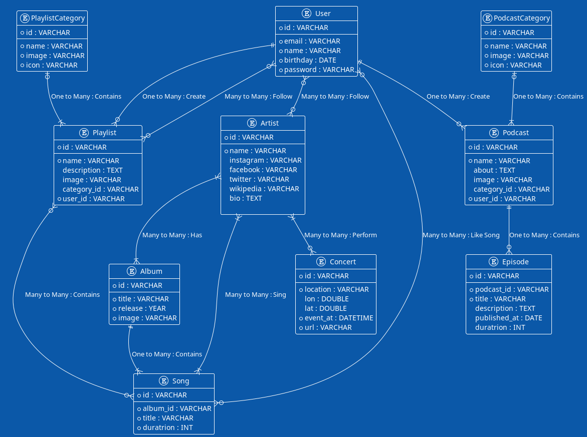

# kepotify
small service spotify

# Schema Database


# Setup Docker
```shell
docker run --rm \
--name restful-kepotify \
-e POSTGRES_DB=kepotifydb \
-e POSTGRES_USER=kepotify \
-e POSTGRES_PASSWORD=PNSJkxXvVNDAhePMuExTBuRR \
-e PGDATA=/var/lib/postgresql/data/pgdata \
-v "$PWD/kepotifydb-data:/var/lib/postgresql/data" \
-p 5432:5432 \
postgres:16
```